Cyclistic Bike-Share Case Study
================
Sean Myro Marcelo

# Introduction

This case study is aimed at understanding user behavior in Cyclistic’s
bike-share program by analyzing historical bike trip data. By
differentiating between casual riders and annual members, we aim to
derive insights to formulate targeted marketing strategies. The ultimate
goal is to convert casual riders into annual members, promoting
Cyclistic’s growth.

``` r
# Import necessary libraries
library(tidyverse)
library(lubridate)

# Define file paths for the datasets for each month
file_paths <- c("202305-divvy-tripdata/202305-divvy-tripdata.csv",
                "202304-divvy-tripdata/202304-divvy-tripdata.csv",
                "202303-divvy-tripdata/202303-divvy-tripdata.csv",
                "202302-divvy-tripdata/202302-divvy-tripdata.csv",
                "202301-divvy-tripdata/202301-divvy-tripdata.csv",
                "202212-divvy-tripdata/202212-divvy-tripdata.csv",
                "202211-divvy-tripdata/202211-divvy-tripdata.csv",
                "202210-divvy-tripdata/202210-divvy-tripdata.csv",
                "202209-divvy-tripdata/202209-divvy-publictripdata.csv",
                "202208-divvy-tripdata/202208-divvy-tripdata.csv",
                "202207-divvy-tripdata/202207-divvy-tripdata.csv",
                "202206-divvy-tripdata/202206-divvy-tripdata.csv")

# Initialize an empty list to store the data frames for each month
data_list <- list()

# Initialize an empty list to store the data frames for each month
for (i in seq_along(file_paths)) {
  data_list[[i]] <- read_csv(file_paths[i])
}

# Combine all monthly data frames into one master data frame "divvy"
divvy <- bind_rows(data_list)
```

## Data Inspection

We begin by inspecting the dataset to understand its structure, identify
the types of data it contains, and check for any missing values or
potential inconsistencies.

### Preview the Dataset

We first look at the first few rows of the dataset to get a glimpse of
its structure and the nature of data it contains.

``` r
head(divvy)
```

    ## # A tibble: 6 × 13
    ##   ride_id          rideable_type started_at          ended_at           
    ##   <chr>            <chr>         <dttm>              <dttm>             
    ## 1 0D9FA920C3062031 electric_bike 2023-05-07 19:53:48 2023-05-07 19:58:32
    ## 2 92485E5FB5888ACD electric_bike 2023-05-06 18:54:08 2023-05-06 19:03:35
    ## 3 FB144B3FC8300187 electric_bike 2023-05-21 00:40:21 2023-05-21 00:44:36
    ## 4 DDEB93BC2CE9AA77 classic_bike  2023-05-10 16:47:01 2023-05-10 16:59:52
    ## 5 C07B70172FC92F59 classic_bike  2023-05-09 18:30:34 2023-05-09 18:39:28
    ## 6 2BA66385DF8F815A classic_bike  2023-05-30 15:01:21 2023-05-30 15:17:00
    ## # ℹ 9 more variables: start_station_name <chr>, start_station_id <chr>,
    ## #   end_station_name <chr>, end_station_id <chr>, start_lat <dbl>,
    ## #   start_lng <dbl>, end_lat <dbl>, end_lng <dbl>, member_casual <chr>

### Descriptive Statistics

To get a better understanding of the variables in our dataset, we can
use the `summary()` function which provides us with some descriptive
statistics.

``` r
summary(divvy)
```

    ##    ride_id          rideable_type        started_at                    
    ##  Length:5829030     Length:5829030     Min.   :2022-06-01 00:00:04.00  
    ##  Class :character   Class :character   1st Qu.:2022-07-27 14:54:51.00  
    ##  Mode  :character   Mode  :character   Median :2022-09-23 07:56:12.50  
    ##                                        Mean   :2022-10-28 01:02:13.02  
    ##                                        3rd Qu.:2023-02-05 15:35:06.75  
    ##                                        Max.   :2023-05-31 23:59:58.00  
    ##                                                                        
    ##     ended_at                      start_station_name start_station_id  
    ##  Min.   :2022-06-01 00:02:38.00   Length:5829030     Length:5829030    
    ##  1st Qu.:2022-07-27 15:16:15.75   Class :character   Class :character  
    ##  Median :2022-09-23 08:14:32.50   Mode  :character   Mode  :character  
    ##  Mean   :2022-10-28 01:20:55.64                                        
    ##  3rd Qu.:2023-02-05 15:50:20.25                                        
    ##  Max.   :2023-06-07 23:04:26.00                                        
    ##                                                                        
    ##  end_station_name   end_station_id       start_lat       start_lng     
    ##  Length:5829030     Length:5829030     Min.   :41.64   Min.   :-87.87  
    ##  Class :character   Class :character   1st Qu.:41.88   1st Qu.:-87.66  
    ##  Mode  :character   Mode  :character   Median :41.90   Median :-87.64  
    ##                                        Mean   :41.90   Mean   :-87.65  
    ##                                        3rd Qu.:41.93   3rd Qu.:-87.63  
    ##                                        Max.   :42.07   Max.   :-87.52  
    ##                                                                        
    ##     end_lat         end_lng       member_casual     
    ##  Min.   : 0.00   Min.   :-88.11   Length:5829030    
    ##  1st Qu.:41.88   1st Qu.:-87.66   Class :character  
    ##  Median :41.90   Median :-87.64   Mode  :character  
    ##  Mean   :41.90   Mean   :-87.65                     
    ##  3rd Qu.:41.93   3rd Qu.:-87.63                     
    ##  Max.   :42.37   Max.   :  0.00                     
    ##  NA's   :5961    NA's   :5961

### Variables Overview

Next, we take a look at the names of the variables in our dataset.

``` r
colnames(divvy)
```

    ##  [1] "ride_id"            "rideable_type"      "started_at"        
    ##  [4] "ended_at"           "start_station_name" "start_station_id"  
    ##  [7] "end_station_name"   "end_station_id"     "start_lat"         
    ## [10] "start_lng"          "end_lat"            "end_lng"           
    ## [13] "member_casual"

### Data Types

Understanding the types of data in our dataset is crucial as it dictates
the kind of analyses we can perform on the variables.

``` r
str(divvy)
```

    ## spc_tbl_ [5,829,030 × 13] (S3: spec_tbl_df/tbl_df/tbl/data.frame)
    ##  $ ride_id           : chr [1:5829030] "0D9FA920C3062031" "92485E5FB5888ACD" "FB144B3FC8300187" "DDEB93BC2CE9AA77" ...
    ##  $ rideable_type     : chr [1:5829030] "electric_bike" "electric_bike" "electric_bike" "classic_bike" ...
    ##  $ started_at        : POSIXct[1:5829030], format: "2023-05-07 19:53:48" "2023-05-06 18:54:08" ...
    ##  $ ended_at          : POSIXct[1:5829030], format: "2023-05-07 19:58:32" "2023-05-06 19:03:35" ...
    ##  $ start_station_name: chr [1:5829030] "Southport Ave & Belmont Ave" "Southport Ave & Belmont Ave" "Halsted St & 21st St" "Carpenter St & Huron St" ...
    ##  $ start_station_id  : chr [1:5829030] "13229" "13229" "13162" "13196" ...
    ##  $ end_station_name  : chr [1:5829030] NA NA NA "Damen Ave & Cortland St" ...
    ##  $ end_station_id    : chr [1:5829030] NA NA NA "13133" ...
    ##  $ start_lat         : num [1:5829030] 41.9 41.9 41.9 41.9 42 ...
    ##  $ start_lng         : num [1:5829030] -87.7 -87.7 -87.6 -87.7 -87.7 ...
    ##  $ end_lat           : num [1:5829030] 41.9 41.9 41.9 41.9 41.9 ...
    ##  $ end_lng           : num [1:5829030] -87.7 -87.7 -87.7 -87.7 -87.7 ...
    ##  $ member_casual     : chr [1:5829030] "member" "member" "member" "member" ...
    ##  - attr(*, "spec")=
    ##   .. cols(
    ##   ..   ride_id = col_character(),
    ##   ..   rideable_type = col_character(),
    ##   ..   started_at = col_datetime(format = ""),
    ##   ..   ended_at = col_datetime(format = ""),
    ##   ..   start_station_name = col_character(),
    ##   ..   start_station_id = col_character(),
    ##   ..   end_station_name = col_character(),
    ##   ..   end_station_id = col_character(),
    ##   ..   start_lat = col_double(),
    ##   ..   start_lng = col_double(),
    ##   ..   end_lat = col_double(),
    ##   ..   end_lng = col_double(),
    ##   ..   member_casual = col_character()
    ##   .. )
    ##  - attr(*, "problems")=<externalptr>

By inspecting the data, we can build a solid foundation for our
subsequent analyses.

## Data Cleaning

The first step of our data cleaning process involves handling missing
values in the dataset.

### Converting Data Types

To support time-based analysis and trip duration calculations, we ensure
the `started_at` and `ended_at` columns are in datetime format.

Before the transformation, we check all entries to confirm they can be
converted to the datetime format:

``` r
# Checking for potential parsing issues
problem_entries <- sum(is.na(lubridate::parse_date_time(divvy$started_at, orders = "ymd HMS")))
```

    ## Warning: 29 failed to parse.

``` r
## Warning: 17 failed to parse.
problem_entries
```

    ## [1] 29

This function returns the number of entries in `started_at` that will
fail to parse into datetime format. We have 29 entries in the
`started_at` column that cannot be parsed, which we expect to be treated
as `NA` during transformation.

``` r
# Transforming 'started_at' and 'ended_at' into datetime format
divvy <- divvy %>% mutate(
  started_at = ymd_hms(started_at),
  ended_at = ymd_hms(ended_at)
)
```

    ## Warning: There were 2 warnings in `mutate()`.
    ## The first warning was:
    ## ℹ In argument: `started_at = ymd_hms(started_at)`.
    ## Caused by warning:
    ## !  29 failed to parse.
    ## ℹ Run `dplyr::last_dplyr_warnings()` to see the 1 remaining warning.

During the datetime conversion, we received a warning that 29 entries in
the `started_at` column failed to parse. This is expected due to known
irregularities in the raw data. These entries were treated as `NA` and
have been accounted for in our downstream analyses.

### Missing Values

Missing data can lead to biased or incorrect results. Therefore, it’s
important to identify any missing values in our dataset.

``` r
# Total missing values
total_na <- sum(is.na(divvy))
paste("Total missing values in the dataset: ", total_na)
```

    ## [1] "Total missing values in the dataset:  3464851"

``` r
# Missing values per column
col_na <- colSums(is.na(divvy))
col_na_list <- paste(names(col_na), ":", col_na)
print(col_na_list)
```

    ##  [1] "ride_id : 0"                 "rideable_type : 0"          
    ##  [3] "started_at : 29"             "ended_at : 23"              
    ##  [5] "start_station_name : 834545" "start_station_id : 834677"  
    ##  [7] "end_station_name : 891757"   "end_station_id : 891898"    
    ##  [9] "start_lat : 0"               "start_lng : 0"              
    ## [11] "end_lat : 5961"              "end_lng : 5961"             
    ## [13] "member_casual : 0"

``` r
# Calculate proportion of missing data
missing_prop <- total_na / prod(dim(divvy))
paste("Proportion of missing data in the dataset: ", round(missing_prop * 100, 2), "%")
```

    ## [1] "Proportion of missing data in the dataset:  4.57 %"

### Handling Missing Values

We detected a total of 3464851 missing data entries. In our subsequent
step, we eliminate rows with these missing values.

``` r
# Summary statistics before dropping missing data
summary_before <- summary(divvy)

# Drop missing data
divvy <- divvy %>% drop_na()

# Summary statistics after dropping missing data
summary_after <- summary(divvy)

# Display summaries
list(before = summary_before, after = summary_after)
```

    ## $before
    ##    ride_id          rideable_type        started_at                    
    ##  Length:5829030     Length:5829030     Min.   :2022-06-01 00:00:04.00  
    ##  Class :character   Class :character   1st Qu.:2022-07-27 14:54:41.00  
    ##  Mode  :character   Mode  :character   Median :2022-09-23 07:56:13.00  
    ##                                        Mean   :2022-10-28 01:02:14.65  
    ##                                        3rd Qu.:2023-02-05 15:35:12.00  
    ##                                        Max.   :2023-05-31 23:59:58.00  
    ##                                        NA's   :29                      
    ##     ended_at                      start_station_name start_station_id  
    ##  Min.   :2022-06-01 00:02:38.00   Length:5829030     Length:5829030    
    ##  1st Qu.:2022-07-27 15:16:22.00   Class :character   Class :character  
    ##  Median :2022-09-23 08:14:46.00   Mode  :character   Mode  :character  
    ##  Mean   :2022-10-28 01:21:12.41                                        
    ##  3rd Qu.:2023-02-05 15:50:41.50                                        
    ##  Max.   :2023-06-07 23:04:26.00                                        
    ##  NA's   :23                                                            
    ##  end_station_name   end_station_id       start_lat       start_lng     
    ##  Length:5829030     Length:5829030     Min.   :41.64   Min.   :-87.87  
    ##  Class :character   Class :character   1st Qu.:41.88   1st Qu.:-87.66  
    ##  Mode  :character   Mode  :character   Median :41.90   Median :-87.64  
    ##                                        Mean   :41.90   Mean   :-87.65  
    ##                                        3rd Qu.:41.93   3rd Qu.:-87.63  
    ##                                        Max.   :42.07   Max.   :-87.52  
    ##                                                                        
    ##     end_lat         end_lng       member_casual     
    ##  Min.   : 0.00   Min.   :-88.11   Length:5829030    
    ##  1st Qu.:41.88   1st Qu.:-87.66   Class :character  
    ##  Median :41.90   Median :-87.64   Mode  :character  
    ##  Mean   :41.90   Mean   :-87.65                     
    ##  3rd Qu.:41.93   3rd Qu.:-87.63                     
    ##  Max.   :42.37   Max.   :  0.00                     
    ##  NA's   :5961    NA's   :5961                       
    ## 
    ## $after
    ##    ride_id          rideable_type        started_at                    
    ##  Length:4494648     Length:4494648     Min.   :2022-06-01 00:00:04.00  
    ##  Class :character   Class :character   1st Qu.:2022-07-25 17:41:32.00  
    ##  Mode  :character   Mode  :character   Median :2022-09-21 14:54:26.50  
    ##                                        Mean   :2022-10-26 20:48:30.31  
    ##                                        3rd Qu.:2023-02-04 15:56:52.25  
    ##                                        Max.   :2023-05-31 23:59:49.00  
    ##     ended_at                      start_station_name start_station_id  
    ##  Min.   :2022-06-01 00:02:38.00   Length:4494648     Length:4494648    
    ##  1st Qu.:2022-07-25 17:57:29.75   Class :character   Class :character  
    ##  Median :2022-09-21 15:09:47.00   Mode  :character   Mode  :character  
    ##  Mean   :2022-10-26 21:04:47.50                                        
    ##  3rd Qu.:2023-02-04 16:09:23.00                                        
    ##  Max.   :2023-06-07 23:04:26.00                                        
    ##  end_station_name   end_station_id       start_lat       start_lng     
    ##  Length:4494648     Length:4494648     Min.   :41.65   Min.   :-87.84  
    ##  Class :character   Class :character   1st Qu.:41.88   1st Qu.:-87.66  
    ##  Mode  :character   Mode  :character   Median :41.90   Median :-87.64  
    ##                                        Mean   :41.90   Mean   :-87.65  
    ##                                        3rd Qu.:41.93   3rd Qu.:-87.63  
    ##                                        Max.   :42.06   Max.   :-87.53  
    ##     end_lat         end_lng       member_casual     
    ##  Min.   : 0.00   Min.   :-87.84   Length:4494648    
    ##  1st Qu.:41.88   1st Qu.:-87.66   Class :character  
    ##  Median :41.90   Median :-87.64   Mode  :character  
    ##  Mean   :41.90   Mean   :-87.65                     
    ##  3rd Qu.:41.93   3rd Qu.:-87.63                     
    ##  Max.   :42.06   Max.   :  0.00

After cleaning, we confirm that no missing values remain in our dataset.

### Creating New Columns

Next, we generate new columns: `trip_duration` (in minutes),
`day_of_week`, and `hour_of_day` to support our forthcoming analysis.

``` r
# Creating 'trip_duration' column
divvy <- divvy %>% mutate(
  trip_duration = as.numeric(difftime(ended_at, started_at, units="mins")) # nolint
)

# Creating 'day_of_week' and 'hour_of_day' columns
divvy <- divvy %>% mutate(
  day_of_week = wday(started_at, label = TRUE),
  hour_of_day = hour(started_at)
)
```

### Additional Time Variables

To analyze trends and patterns over time, we create additional time
variables: `semi_annual`, `quarterly`, and `monthly`. These variables
allow us to observe trends within different timeframes.

``` r
# Creating new time variables
divvy <- divvy %>%
  mutate(semi_annual = case_when(
    month(started_at) %in% 1:6 ~ paste(year(started_at), "H1"),
    month(started_at) %in% 7:12 ~ paste(year(started_at), "H2")
  ),
  quarterly = paste(year(started_at), "Q", quarter(started_at)),
  monthly = paste(year(started_at), month(started_at, label = TRUE))
  )
```

With these transformations, our dataset is now prepared for exploratory
data analysis.

## Data Analysis

After preprocessing the data, we can now move on to the data analysis
part. We are interested in comparing the behaviors of casual riders and
annual members. We can analyze the frequency of rides, preferred bike
type, average trip duration, and common routes for each user group.

### Analysis of Rides Frequency

First, we can start by comparing the frequency of rides between casual
riders and annual members.

``` r
# Calculate ride count for each rider type
ride_counts <- divvy %>%
  group_by(semi_annual, quarterly, monthly, member_casual) %>%
  summarise(ride_count = n(), .groups = "drop")

# Preview the data frame
print(ride_counts, n = 50)
```

    ## # A tibble: 24 × 5
    ##    semi_annual quarterly monthly  member_casual ride_count
    ##    <chr>       <chr>     <chr>    <chr>              <int>
    ##  1 2022 H1     2022 Q 2  2022 Jun casual            292064
    ##  2 2022 H1     2022 Q 2  2022 Jun member            328279
    ##  3 2022 H2     2022 Q 3  2022 Aug casual            270093
    ##  4 2022 H2     2022 Q 3  2022 Aug member            335228
    ##  5 2022 H2     2022 Q 3  2022 Jul casual            311675
    ##  6 2022 H2     2022 Q 3  2022 Jul member            330999
    ##  7 2022 H2     2022 Q 3  2022 Sep casual            220912
    ##  8 2022 H2     2022 Q 3  2022 Sep member            314228
    ##  9 2022 H2     2022 Q 4  2022 Dec casual             31505
    ## 10 2022 H2     2022 Q 4  2022 Dec member            103895
    ## 11 2022 H2     2022 Q 4  2022 Nov casual             73555
    ## 12 2022 H2     2022 Q 4  2022 Nov member            182237
    ## 13 2022 H2     2022 Q 4  2022 Oct casual            151324
    ## 14 2022 H2     2022 Q 4  2022 Oct member            262944
    ## 15 2023 H1     2023 Q 1  2023 Feb casual             32776
    ## 16 2023 H1     2023 Q 1  2023 Feb member            116783
    ## 17 2023 H1     2023 Q 1  2023 Jan casual             29621
    ## 18 2023 H1     2023 Q 1  2023 Jan member            118663
    ## 19 2023 H1     2023 Q 1  2023 Mar casual             46792
    ## 20 2023 H1     2023 Q 1  2023 Mar member            153655
    ## 21 2023 H1     2023 Q 2  2023 Apr casual            110537
    ## 22 2023 H1     2023 Q 2  2023 Apr member            213659
    ## 23 2023 H1     2023 Q 2  2023 May casual            177039
    ## 24 2023 H1     2023 Q 2  2023 May member            286185

``` r
# Visualize the result in a bar chart
ggplot(ride_counts, aes(x = member_casual, y = ride_count, fill = member_casual)) +
  geom_bar(stat = "identity") +
  labs(title = "Ride Frequency by User Type", x = "User Type", y = "Ride Count") +
  theme_minimal()
```

<!-- -->

``` r
# Visualize the result in a bar chart - Semi-annually
ggplot(ride_counts, aes(x = member_casual, y = ride_count, fill = member_casual)) +
  geom_bar(stat = "identity") +
  facet_wrap(~semi_annual) +
  labs(title = "Semi-Annual Ride Frequency by User Type", x = "User Type", y = "Ride Count") +
  theme_minimal()
```

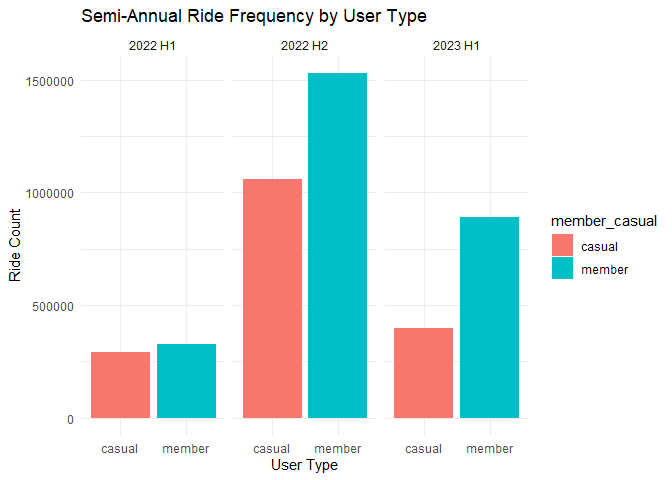<!-- -->

``` r
# Visualize the result in a bar chart - Quarterly
ggplot(ride_counts, aes(x = member_casual, y = ride_count, fill = member_casual)) +
  geom_bar(stat = "identity") +
  facet_wrap(~quarterly) +
  labs(title = "Quarterly Ride Frequency by User Type", x = "User Type", y = "Ride Count") +
  theme_minimal()
```

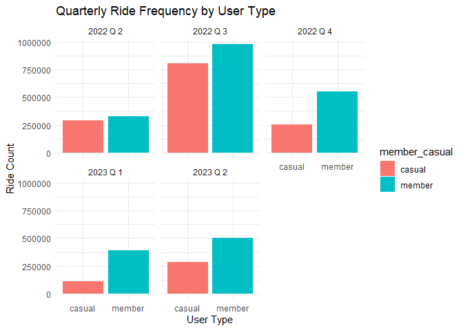<!-- -->

``` r
# Visualize the result in a bar chart - Monthly
ggplot(ride_counts, aes(x = member_casual, y = ride_count, fill = member_casual)) +
  geom_bar(stat = "identity") +
  facet_wrap(~monthly) +
  labs(title = "Monthly Ride Frequency by User Type", x = "User Type", y = "Ride Count") +
  theme_minimal()
```

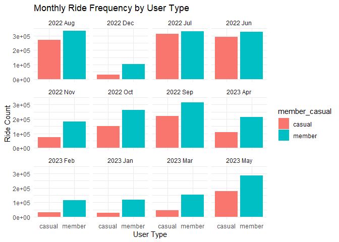<!-- -->

### Analysis of Preferred Bike Type

Next, let’s analyze which bike types are preferred by casual riders and
annual members.

``` r
# Determine preferred bike type for each user type
bike_pref <- divvy %>%
  group_by(semi_annual, quarterly, monthly, member_casual, rideable_type) %>%
  summarise(bike_count = n(), .groups = "drop")

# Preview the data frame
print(bike_pref, n = 50)
```

    ## # A tibble: 60 × 6
    ##    semi_annual quarterly monthly  member_casual rideable_type bike_count
    ##    <chr>       <chr>     <chr>    <chr>         <chr>              <int>
    ##  1 2022 H1     2022 Q 2  2022 Jun casual        classic_bike      169446
    ##  2 2022 H1     2022 Q 2  2022 Jun casual        docked_bike        30210
    ##  3 2022 H1     2022 Q 2  2022 Jun casual        electric_bike      92408
    ##  4 2022 H1     2022 Q 2  2022 Jun member        classic_bike      236560
    ##  5 2022 H1     2022 Q 2  2022 Jun member        electric_bike      91719
    ##  6 2022 H2     2022 Q 3  2022 Aug casual        classic_bike      128307
    ##  7 2022 H2     2022 Q 3  2022 Aug casual        docked_bike        25888
    ##  8 2022 H2     2022 Q 3  2022 Aug casual        electric_bike     115898
    ##  9 2022 H2     2022 Q 3  2022 Aug member        classic_bike      215326
    ## 10 2022 H2     2022 Q 3  2022 Aug member        electric_bike     119902
    ## 11 2022 H2     2022 Q 3  2022 Jul casual        classic_bike      155676
    ## 12 2022 H2     2022 Q 3  2022 Jul casual        docked_bike        30599
    ## 13 2022 H2     2022 Q 3  2022 Jul casual        electric_bike     125400
    ## 14 2022 H2     2022 Q 3  2022 Jul member        classic_bike      216997
    ## 15 2022 H2     2022 Q 3  2022 Jul member        electric_bike     114002
    ## 16 2022 H2     2022 Q 3  2022 Sep casual        classic_bike      105078
    ## 17 2022 H2     2022 Q 3  2022 Sep casual        docked_bike        19488
    ## 18 2022 H2     2022 Q 3  2022 Sep casual        electric_bike      96346
    ## 19 2022 H2     2022 Q 3  2022 Sep member        classic_bike      200668
    ## 20 2022 H2     2022 Q 3  2022 Sep member        electric_bike     113560
    ## 21 2022 H2     2022 Q 4  2022 Dec casual        classic_bike       12600
    ## 22 2022 H2     2022 Q 4  2022 Dec casual        docked_bike         1872
    ## 23 2022 H2     2022 Q 4  2022 Dec casual        electric_bike      17033
    ## 24 2022 H2     2022 Q 4  2022 Dec member        classic_bike       60670
    ## 25 2022 H2     2022 Q 4  2022 Dec member        electric_bike      43225
    ## 26 2022 H2     2022 Q 4  2022 Nov casual        classic_bike       32953
    ## 27 2022 H2     2022 Q 4  2022 Nov casual        docked_bike         5794
    ## 28 2022 H2     2022 Q 4  2022 Nov casual        electric_bike      34808
    ## 29 2022 H2     2022 Q 4  2022 Nov member        classic_bike      111503
    ## 30 2022 H2     2022 Q 4  2022 Nov member        electric_bike      70734
    ## 31 2022 H2     2022 Q 4  2022 Oct casual        classic_bike       61403
    ## 32 2022 H2     2022 Q 4  2022 Oct casual        docked_bike        12396
    ## 33 2022 H2     2022 Q 4  2022 Oct casual        electric_bike      77525
    ## 34 2022 H2     2022 Q 4  2022 Oct member        classic_bike      151888
    ## 35 2022 H2     2022 Q 4  2022 Oct member        electric_bike     111056
    ## 36 2023 H1     2023 Q 1  2023 Feb casual        classic_bike       15446
    ## 37 2023 H1     2023 Q 1  2023 Feb casual        docked_bike         2151
    ## 38 2023 H1     2023 Q 1  2023 Feb casual        electric_bike      15179
    ## 39 2023 H1     2023 Q 1  2023 Feb member        classic_bike       74223
    ## 40 2023 H1     2023 Q 1  2023 Feb member        electric_bike      42560
    ## 41 2023 H1     2023 Q 1  2023 Jan casual        classic_bike       13860
    ## 42 2023 H1     2023 Q 1  2023 Jan casual        docked_bike         1682
    ## 43 2023 H1     2023 Q 1  2023 Jan casual        electric_bike      14079
    ## 44 2023 H1     2023 Q 1  2023 Jan member        classic_bike       76359
    ## 45 2023 H1     2023 Q 1  2023 Jan member        electric_bike      42304
    ## 46 2023 H1     2023 Q 1  2023 Mar casual        classic_bike       19380
    ## 47 2023 H1     2023 Q 1  2023 Mar casual        docked_bike         2944
    ## 48 2023 H1     2023 Q 1  2023 Mar casual        electric_bike      24468
    ## 49 2023 H1     2023 Q 1  2023 Mar member        classic_bike       87596
    ## 50 2023 H1     2023 Q 1  2023 Mar member        electric_bike      66059
    ## # ℹ 10 more rows

``` r
# Visualize the result in a bar chart
ggplot(bike_pref, aes(x = member_casual, y = bike_count, fill = rideable_type)) +
  geom_bar(stat = "identity", position = "dodge") +
  labs(title = "Bike Preference by User Type", x = "User Type", y = "Bike Count") +
  theme_minimal()
```

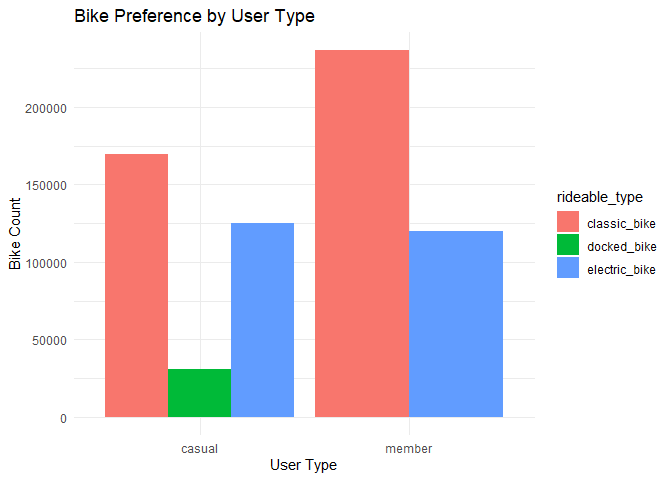<!-- -->

``` r
# Visualize the result in a bar chart - Semi-annually
bike_pref %>%
  ggplot(aes(x = member_casual, y = bike_count, fill = rideable_type)) +
  geom_bar(stat = "identity", position = "dodge") +
  facet_wrap(~semi_annual) +
  labs(title = "Semi-annual Bike Preference by User Type", x = "User Type", y = "Bike Count") +
  theme_minimal()
```

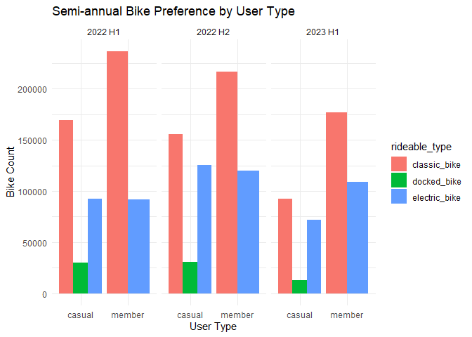<!-- -->

``` r
# Visualize the result in a bar chart - Quarterly
bike_pref %>%
  ggplot(aes(x = member_casual, y = bike_count, fill = rideable_type)) +
  geom_bar(stat = "identity", position = "dodge") +
  facet_wrap(~quarterly) +
  labs(title = "Quarterly Bike Preference by User Type", x = "User Type", y = "Bike Count") +
  theme_minimal()
```

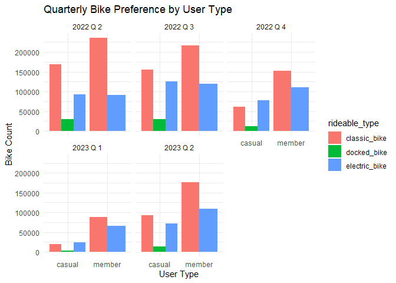<!-- -->

``` r
# Visualize the result in a bar chart - Monthly
bike_pref %>%
  ggplot(aes(x = member_casual, y = bike_count, fill = rideable_type)) +
  geom_bar(stat = "identity", position = "dodge") +
  facet_wrap(~monthly) +
  labs(title = "Monthly Bike Preference by User Type", x = "User Type", y = "Bike Count") +
  theme_minimal()
```

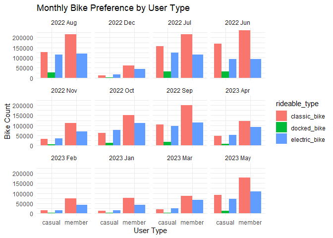<!-- -->

### Analysis of Average Trip Duration

Now, let’s find out if there is any difference in average trip duration
between casual riders and annual members.

``` r
# Calculate average trip duration for each user type
avg_duration <- divvy %>%
  group_by(semi_annual, quarterly, monthly, member_casual) %>%
  summarise(avg_trip_duration = mean(trip_duration, na.rm = TRUE), .groups = "drop")

# Preview the data frame
print(avg_duration, n = 50)
```

    ## # A tibble: 24 × 5
    ##    semi_annual quarterly monthly  member_casual avg_trip_duration
    ##    <chr>       <chr>     <chr>    <chr>                     <dbl>
    ##  1 2022 H1     2022 Q 2  2022 Jun casual                     25.0
    ##  2 2022 H1     2022 Q 2  2022 Jun member                     13.7
    ##  3 2022 H2     2022 Q 3  2022 Aug casual                     23.3
    ##  4 2022 H2     2022 Q 3  2022 Aug member                     13.1
    ##  5 2022 H2     2022 Q 3  2022 Jul casual                     25.1
    ##  6 2022 H2     2022 Q 3  2022 Jul member                     13.5
    ##  7 2022 H2     2022 Q 3  2022 Sep casual                     21.8
    ##  8 2022 H2     2022 Q 3  2022 Sep member                     12.6
    ##  9 2022 H2     2022 Q 4  2022 Dec casual                     14.8
    ## 10 2022 H2     2022 Q 4  2022 Dec member                     10.2
    ## 11 2022 H2     2022 Q 4  2022 Nov casual                     17.2
    ## 12 2022 H2     2022 Q 4  2022 Nov member                     10.8
    ## 13 2022 H2     2022 Q 4  2022 Oct casual                     20.5
    ## 14 2022 H2     2022 Q 4  2022 Oct member                     11.7
    ## 15 2023 H1     2023 Q 1  2023 Feb casual                     17.7
    ## 16 2023 H1     2023 Q 1  2023 Feb member                     10.4
    ## 17 2023 H1     2023 Q 1  2023 Jan casual                     14.9
    ## 18 2023 H1     2023 Q 1  2023 Jan member                     10.0
    ## 19 2023 H1     2023 Q 1  2023 Mar casual                     16.7
    ## 20 2023 H1     2023 Q 1  2023 Mar member                     10.2
    ## 21 2023 H1     2023 Q 2  2023 Apr casual                     22.6
    ## 22 2023 H1     2023 Q 2  2023 Apr member                     11.6
    ## 23 2023 H1     2023 Q 2  2023 May casual                     24.5
    ## 24 2023 H1     2023 Q 2  2023 May member                     12.7

``` r
# Visualize the result in a bar chart
ggplot(avg_duration, aes(x = member_casual, y = avg_trip_duration, fill = member_casual)) +
  geom_bar(stat = "identity") +
  labs(title = "Average Trip Duration by User Type", x = "User Type", y = "Avg Trip Duration (mins)") +
  theme_minimal()
```

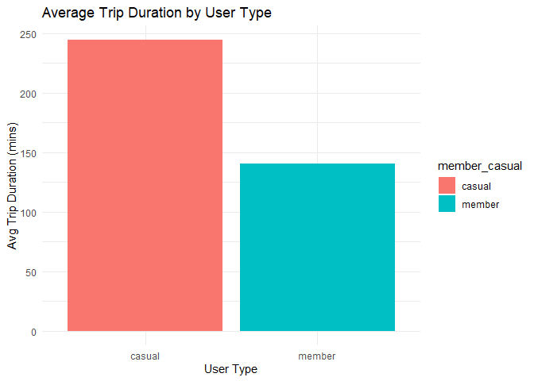<!-- -->

``` r
# Visualize the result in a bar chart - Semi-annually
avg_duration %>%
  ggplot(aes(x = member_casual, y = avg_trip_duration, fill = member_casual)) +
  geom_bar(stat = "identity") +
  facet_wrap(~semi_annual) +
  labs(title = "Semi-annual Average Trip Duration by User Type", x = "User Type", y = "Avg Trip Duration (mins)") +
  theme_minimal()
```

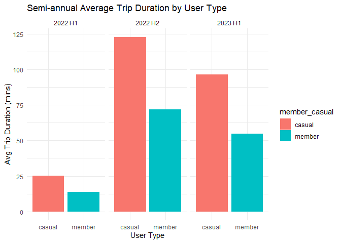<!-- -->

``` r
# Visualize the result in a bar chart - Quarterly
avg_duration %>%
  ggplot(aes(x = member_casual, y = avg_trip_duration, fill = member_casual)) +
  geom_bar(stat = "identity") +
  facet_wrap(~quarterly) +
  labs(title = "Quarterly Average Trip Duration by User Type", x = "User Type", y = "Avg Trip Duration (mins)") +
  theme_minimal()
```

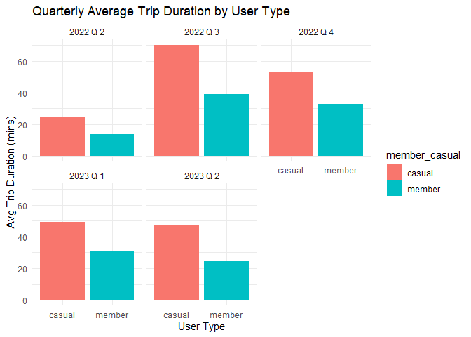<!-- -->

``` r
# Visualize the result in a bar chart - Monthly
avg_duration %>%
  ggplot(aes(x = member_casual, y = avg_trip_duration, fill = member_casual)) +
  geom_bar(stat = "identity") +
  facet_wrap(~monthly) +
  labs(title = "Monthly Average Trip Duration by User Type", x = "User Type", y = "Avg Trip Duration (mins)") +
  theme_minimal()
```

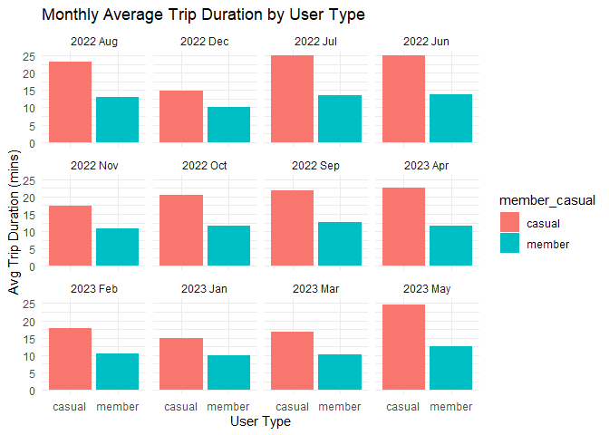<!-- -->

### Analysis of Common Routes

Lastly, we can explore the common routes for each user group.

``` r
# Identify top 5 common routes for each user type
top_routes <- divvy %>%
  mutate(route = paste(start_station_name, end_station_name, sep = " to ")) %>%
  group_by(member_casual, route) %>%
  summarise(route_count = n(), .groups = "drop") %>%
  arrange(member_casual, desc(route_count)) %>%
  group_by(member_casual) %>%
  slice_head(n = 5)

# Preview the data frame
print(top_routes)
```

    ## # A tibble: 10 × 3
    ## # Groups:   member_casual [2]
    ##    member_casual route                                               route_count
    ##    <chr>         <chr>                                                     <int>
    ##  1 casual        Streeter Dr & Grand Ave to Streeter Dr & Grand Ave        10092
    ##  2 casual        DuSable Lake Shore Dr & Monroe St to DuSable Lake …        6646
    ##  3 casual        DuSable Lake Shore Dr & Monroe St to Streeter Dr &…        5101
    ##  4 casual        Michigan Ave & Oak St to Michigan Ave & Oak St             4479
    ##  5 casual        Millennium Park to Millennium Park                         4028
    ##  6 member        Ellis Ave & 60th St to University Ave & 57th St            6245
    ##  7 member        University Ave & 57th St to Ellis Ave & 60th St            5894
    ##  8 member        Ellis Ave & 60th St to Ellis Ave & 55th St                 5719
    ##  9 member        Ellis Ave & 55th St to Ellis Ave & 60th St                 5394
    ## 10 member        State St & 33rd St to Calumet Ave & 33rd St                4116

``` r
# Visualize the result in a bar chart
top_routes %>%
  ggplot(aes(x = reorder(route, route_count), y = route_count, fill = member_casual)) +
  geom_bar(stat = "identity") +
  labs(title = "Top 5 Routes by User Type", x = "Route", y = "Route Count") +
  coord_flip() +
  theme_minimal()
```

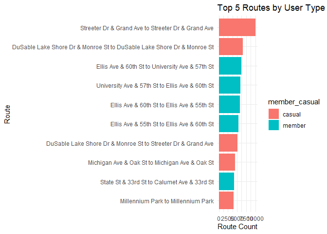<!-- -->

These results will provide insights into the motivations and preferences
of casual riders, and help design targeted marketing strategies to
convert them into annual members.

# Additional Insights

Now, let’s compute some additional statistics that might be of interest.

``` r
# Calculate mean trip duration
mean_trip_duration <- mean(divvy$trip_duration, na.rm = TRUE)

# Identify max trip duration
max_trip_duration <- max(divvy$trip_duration, na.rm = TRUE)

# Find most frequent day of the week
day_of_week_mode <- divvy$day_of_week %>%
  table() %>%
  which.max() %>%
  names()

# Visualize mean and maximum trip durations
cat("Mean trip duration: ", mean_trip_duration, " minutes\n")
```

    ## Mean trip duration:  16.28644  minutes

``` r
cat("Max trip duration: ", max_trip_duration, " minutes\n")
```

    ## Max trip duration:  32035.45  minutes

``` r
# Visualize most frequent day of the week
cat("Most frequent day of the week: ", day_of_week_mode, "\n")
```

    ## Most frequent day of the week:  Sat

``` r
# Calculate average trip duration and number of rides for each user type by day_of_week
avg_trip_duration_day <- divvy %>%
  group_by(member_casual, day_of_week) %>%
  summarise(avg_trip_duration = mean(trip_duration, na.rm = TRUE), .groups = "drop")

print(avg_trip_duration_day, n = 50)
```

    ## # A tibble: 14 × 3
    ##    member_casual day_of_week avg_trip_duration
    ##    <chr>         <ord>                   <dbl>
    ##  1 casual        Sun                      26.2
    ##  2 casual        Mon                      22.8
    ##  3 casual        Tue                      20.4
    ##  4 casual        Wed                      19.6
    ##  5 casual        Thu                      20.2
    ##  6 casual        Fri                      21.8
    ##  7 casual        Sat                      25.4
    ##  8 member        Sun                      13.6
    ##  9 member        Mon                      11.6
    ## 10 member        Tue                      11.7
    ## 11 member        Wed                      11.7
    ## 12 member        Thu                      11.8
    ## 13 member        Fri                      12.0
    ## 14 member        Sat                      13.7

``` r
rides_day <- divvy %>%
  group_by(member_casual, day_of_week) %>%
  summarise(ride_count = n(), .groups = "drop")

print(rides_day, n = 50)
```

    ## # A tibble: 14 × 3
    ##    member_casual day_of_week ride_count
    ##    <chr>         <ord>            <int>
    ##  1 casual        Sun             289569
    ##  2 casual        Mon             194972
    ##  3 casual        Tue             202336
    ##  4 casual        Wed             218110
    ##  5 casual        Thu             233764
    ##  6 casual        Fri             258174
    ##  7 casual        Sat             350968
    ##  8 member        Sun             303835
    ##  9 member        Mon             374373
    ## 10 member        Tue             438808
    ## 11 member        Wed             456845
    ## 12 member        Thu             442117
    ## 13 member        Fri             387059
    ## 14 member        Sat             343718

``` r
# Visualize average trip duration by day of the week for each rider type
ggplot(avg_trip_duration_day, aes(x = day_of_week, y = avg_trip_duration, fill = member_casual)) +
  geom_bar(stat = "identity", position = "dodge") +
  labs(title = "Average Trip Duration by Day of the Week", x = "Day of the Week", y = "Average Trip Duration (minutes)") +
  theme_minimal()
```

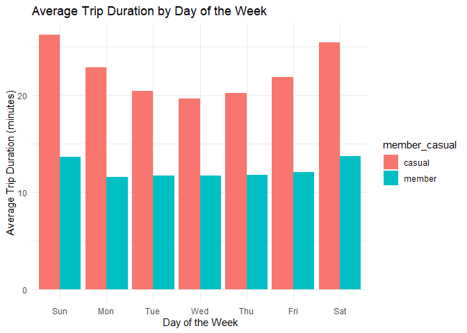<!-- -->

``` r
# Visualize ride counts by day of the week for each rider type
ggplot(rides_day, aes(x = day_of_week, y = ride_count, fill = member_casual)) +
  geom_bar(stat = "identity", position = "dodge") +
  labs(title = "Ride Counts by Day of the Week", x = "Day of the Week", y = "Ride Counts") +
  theme_minimal()
```

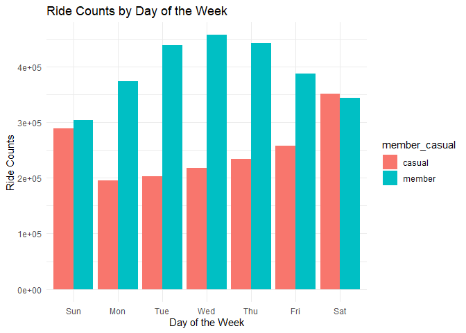<!-- -->

``` r
# Calculate average trip duration and number of rides for each user type by hour_of_day
avg_trip_duration_hour <- divvy %>%
  group_by(member_casual, hour_of_day) %>%
  summarise(avg_trip_duration = mean(trip_duration, na.rm = TRUE), .groups = "drop")

print(avg_trip_duration_hour, n = 50)
```

    ## # A tibble: 48 × 3
    ##    member_casual hour_of_day avg_trip_duration
    ##    <chr>               <int>             <dbl>
    ##  1 casual                  0              20.3
    ##  2 casual                  1              21.7
    ##  3 casual                  2              20.9
    ##  4 casual                  3              19.8
    ##  5 casual                  4              18.0
    ##  6 casual                  5              15.4
    ##  7 casual                  6              14.9
    ##  8 casual                  7              14.6
    ##  9 casual                  8              16.7
    ## 10 casual                  9              22.5
    ## 11 casual                 10              26.7
    ## 12 casual                 11              27.3
    ## 13 casual                 12              26.8
    ## 14 casual                 13              26.7
    ## 15 casual                 14              26.6
    ## 16 casual                 15              24.9
    ## 17 casual                 16              22.8
    ## 18 casual                 17              21.3
    ## 19 casual                 18              21.5
    ## 20 casual                 19              21.1
    ## 21 casual                 20              21.0
    ## 22 casual                 21              19.7
    ## 23 casual                 22              19.3
    ## 24 casual                 23              19.9
    ## 25 member                  0              11.8
    ## 26 member                  1              11.9
    ## 27 member                  2              12.2
    ## 28 member                  3              12.1
    ## 29 member                  4              12.4
    ## 30 member                  5              10.2
    ## 31 member                  6              10.5
    ## 32 member                  7              11.1
    ## 33 member                  8              11.0
    ## 34 member                  9              11.2
    ## 35 member                 10              12.0
    ## 36 member                 11              12.2
    ## 37 member                 12              12.1
    ## 38 member                 13              12.2
    ## 39 member                 14              12.6
    ## 40 member                 15              12.5
    ## 41 member                 16              12.7
    ## 42 member                 17              13.0
    ## 43 member                 18              12.9
    ## 44 member                 19              12.7
    ## 45 member                 20              12.5
    ## 46 member                 21              12.1
    ## 47 member                 22              12.2
    ## 48 member                 23              12.2

``` r
rides_hour <- divvy %>%
  group_by(member_casual, hour_of_day) %>%
  summarise(ride_count = n(), .groups = "drop")

print(rides_hour, n = 50)
```

    ## # A tibble: 48 × 3
    ##    member_casual hour_of_day ride_count
    ##    <chr>               <int>      <int>
    ##  1 casual                  0      32048
    ##  2 casual                  1      20833
    ##  3 casual                  2      12246
    ##  4 casual                  3       6763
    ##  5 casual                  4       4515
    ##  6 casual                  5       8707
    ##  7 casual                  6      23392
    ##  8 casual                  7      40351
    ##  9 casual                  8      55069
    ## 10 casual                  9      56194
    ## 11 casual                 10      72237
    ## 12 casual                 11      93447
    ## 13 casual                 12     109910
    ## 14 casual                 13     114537
    ## 15 casual                 14     121201
    ## 16 casual                 15     134849
    ## 17 casual                 16     153625
    ## 18 casual                 17     170546
    ## 19 casual                 18     148467
    ## 20 casual                 19     111926
    ## 21 casual                 20      81398
    ## 22 casual                 21      69352
    ## 23 casual                 22      61477
    ## 24 casual                 23      44803
    ## 25 member                  0      25576
    ## 26 member                  1      15656
    ## 27 member                  2       8737
    ## 28 member                  3       5268
    ## 29 member                  4       6097
    ## 30 member                  5      26050
    ## 31 member                  6      81663
    ## 32 member                  7     151674
    ## 33 member                  8     180596
    ## 34 member                  9     120043
    ## 35 member                 10     109540
    ## 36 member                 11     129722
    ## 37 member                 12     149413
    ## 38 member                 13     147817
    ## 39 member                 14     148811
    ## 40 member                 15     183336
    ## 41 member                 16     249057
    ## 42 member                 17     297750
    ## 43 member                 18     233324
    ## 44 member                 19     165950
    ## 45 member                 20     115173
    ## 46 member                 21      88671
    ## 47 member                 22      65509
    ## 48 member                 23      41322

``` r
# Visualize average trip duration by hour of the day for each rider type

ggplot(avg_trip_duration_hour, aes(x = hour_of_day, y = avg_trip_duration, fill = member_casual)) +
  geom_bar(stat = "identity", position = "dodge") +
  labs(title = "Average Trip Duration by Hour of the Day", x = "Hour of the Day", y = "Average Trip Duration (minutes)") +
  theme_minimal()
```

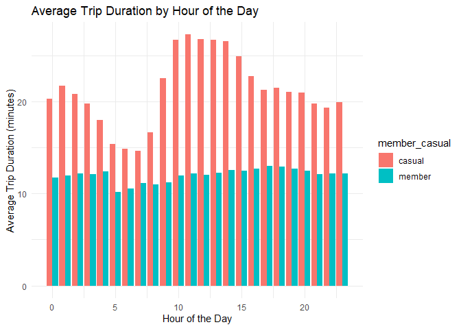<!-- -->

``` r
# Visualize ride counts by hour of the day for each rider type
ggplot(rides_hour, aes(x = hour_of_day, y = ride_count, fill = member_casual)) +
  geom_bar(stat = "identity", position = "dodge") +
  labs(title = "Ride Counts by Hour of the Day", x = "Hour of the Day", y = "Ride Counts") +
  theme_minimal()
```

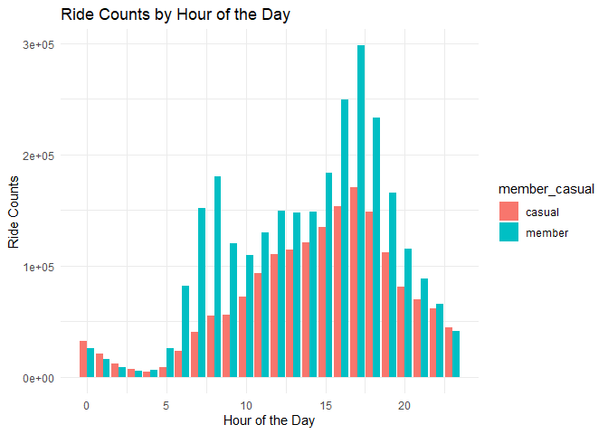<!-- -->

# Conclusion

Based on the data analysis and the ultimate goal of converting casual
riders into annual members, we conclude that there are different usage
patterns between the two user types. Casual riders tend to ride longer,
prefer classic and electric bikes, and use the service more heavily on
weekends, often on specific routes that might be associated with
recreational activities. Members, on the other hand, use the service
more frequently, have shorter ride durations, use classic bikes more
often, and use the service extensively throughout the week, indicating
daily commuting patterns.

These differences provide an opportunity to tailor marketing strategies
to convert casual riders into annual members.

# Recommendations

1.  **Introduce Cost-Effective Membership Plans**: Casual riders tend to
    have longer ride durations. They may benefit from membership plans
    that offer better cost-effectiveness for longer rides. Introduce
    membership plans highlighting the financial benefits for longer
    trips to attract this group. This could be bundled with a trial
    period to reduce the risk for casual riders.

2.  **Launch Weekend Promotions for Members**: Members use the service
    more consistently throughout the week, but both casual riders and
    members ride longer on weekends. This pattern suggests a potential
    interest in leisurely or recreational rides among members. Offering
    weekend promotions or organizing member-exclusive events during
    weekends could incentivize casual riders to convert into members to
    avail of these benefits.

3.  **Enhance Bike Availability**: Classic bikes are preferred by both
    user groups. Ensuring the availability of classic bikes could
    improve the user experience. This could be promoted among casual
    users to showcase the reliability of the service.

Implementing these recommendations would require a balanced approach,
ensuring existing services for members are not disrupted. Monitoring the
impact of these changes and taking user feedback into consideration will
be crucial to fine-tune these strategies moving forward.
