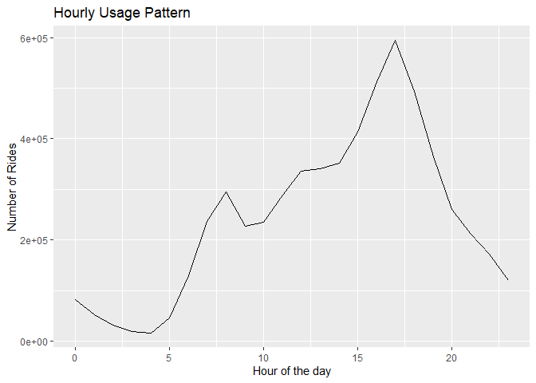

Cyclistic Bike-Share Case Study
================
Sean Myro Marcelo

# Introduction

The goal of this case study is to design marketing strategies aimed at
converting casual riders into annual members by analyzing the Cyclistic
historical bike trip data to identify trends.

``` r
# Import necessary libraries
library(tidyverse)
library(lubridate)

# Define file paths using a pattern
# This assumes files are consistently named and in the same directory
# Change the path and pattern according to your data
file_paths <- list.files(path  =  ".", pattern  =  "*divvy-tripdata.csv", full.names  =  TRUE)

# Use map_df to read in and bind rows in one step
divvy <- map_df(file_paths, read_csv)
```

# Data Inspection

We begin by inspecting the dataset to understand its structure, identify
the types of data it contains, and check for any missing values or
potential inconsistencies.

## Preview the Dataset

We first look at the first few rows of the dataset to get a glimpse of
its structure and the nature of data it contains.

``` r
head(divvy)
```

    ## # A tibble: 6 × 13
    ##   ride_id          rideable_type started_at          ended_at           
    ##   <chr>            <chr>         <dttm>              <dttm>             
    ## 1 600CFD130D0FD2A4 electric_bike 2022-06-30 17:27:53 2022-06-30 17:35:15
    ## 2 F5E6B5C1682C6464 electric_bike 2022-06-30 18:39:52 2022-06-30 18:47:28
    ## 3 B6EB6D27BAD771D2 electric_bike 2022-06-30 11:49:25 2022-06-30 12:02:54
    ## 4 C9C320375DE1D5C6 electric_bike 2022-06-30 11:15:25 2022-06-30 11:19:43
    ## 5 56C055851023BE98 electric_bike 2022-06-29 23:36:50 2022-06-29 23:45:17
    ## 6 B664188E8163D045 electric_bike 2022-06-30 16:42:10 2022-06-30 16:58:22
    ## # ℹ 9 more variables: start_station_name <chr>, start_station_id <chr>,
    ## #   end_station_name <chr>, end_station_id <chr>, start_lat <dbl>,
    ## #   start_lng <dbl>, end_lat <dbl>, end_lng <dbl>, member_casual <chr>

## Descriptive Statistics

To get a better understanding of the variables in our dataset, we can
use the `summary()` function which provides us with some descriptive
statistics.

``` r
summary(divvy)
```

    ##    ride_id          rideable_type        started_at                    
    ##  Length:5829030     Length:5829030     Min.   :2022-06-01 00:00:04.00  
    ##  Class :character   Class :character   1st Qu.:2022-07-27 14:54:51.00  
    ##  Mode  :character   Mode  :character   Median :2022-09-23 07:56:12.50  
    ##                                        Mean   :2022-10-28 01:02:13.02  
    ##                                        3rd Qu.:2023-02-05 15:35:06.75  
    ##                                        Max.   :2023-05-31 23:59:58.00  
    ##                                                                        
    ##     ended_at                      start_station_name start_station_id  
    ##  Min.   :2022-06-01 00:02:38.00   Length:5829030     Length:5829030    
    ##  1st Qu.:2022-07-27 15:16:15.75   Class :character   Class :character  
    ##  Median :2022-09-23 08:14:32.50   Mode  :character   Mode  :character  
    ##  Mean   :2022-10-28 01:20:55.64                                        
    ##  3rd Qu.:2023-02-05 15:50:20.25                                        
    ##  Max.   :2023-06-07 23:04:26.00                                        
    ##                                                                        
    ##  end_station_name   end_station_id       start_lat       start_lng     
    ##  Length:5829030     Length:5829030     Min.   :41.64   Min.   :-87.87  
    ##  Class :character   Class :character   1st Qu.:41.88   1st Qu.:-87.66  
    ##  Mode  :character   Mode  :character   Median :41.90   Median :-87.64  
    ##                                        Mean   :41.90   Mean   :-87.65  
    ##                                        3rd Qu.:41.93   3rd Qu.:-87.63  
    ##                                        Max.   :42.07   Max.   :-87.52  
    ##                                                                        
    ##     end_lat         end_lng       member_casual     
    ##  Min.   : 0.00   Min.   :-88.11   Length:5829030    
    ##  1st Qu.:41.88   1st Qu.:-87.66   Class :character  
    ##  Median :41.90   Median :-87.64   Mode  :character  
    ##  Mean   :41.90   Mean   :-87.65                     
    ##  3rd Qu.:41.93   3rd Qu.:-87.63                     
    ##  Max.   :42.37   Max.   :  0.00                     
    ##  NA's   :5961    NA's   :5961

## Variables Overview

Next, we take a look at the names of the variables in our dataset.

``` r
colnames(divvy)
```

    ##  [1] "ride_id"            "rideable_type"      "started_at"        
    ##  [4] "ended_at"           "start_station_name" "start_station_id"  
    ##  [7] "end_station_name"   "end_station_id"     "start_lat"         
    ## [10] "start_lng"          "end_lat"            "end_lng"           
    ## [13] "member_casual"

## Data Types

Understanding the types of data in our dataset is crucial as it dictates
the kind of analyses we can perform on the variables.

``` r
str(divvy)
```

    ## spc_tbl_ [5,829,030 × 13] (S3: spec_tbl_df/tbl_df/tbl/data.frame)
    ##  $ ride_id           : chr [1:5829030] "600CFD130D0FD2A4" "F5E6B5C1682C6464" "B6EB6D27BAD771D2" "C9C320375DE1D5C6" ...
    ##  $ rideable_type     : chr [1:5829030] "electric_bike" "electric_bike" "electric_bike" "electric_bike" ...
    ##  $ started_at        : POSIXct[1:5829030], format: "2022-06-30 17:27:53" "2022-06-30 18:39:52" ...
    ##  $ ended_at          : POSIXct[1:5829030], format: "2022-06-30 17:35:15" "2022-06-30 18:47:28" ...
    ##  $ start_station_name: chr [1:5829030] NA NA NA NA ...
    ##  $ start_station_id  : chr [1:5829030] NA NA NA NA ...
    ##  $ end_station_name  : chr [1:5829030] NA NA NA NA ...
    ##  $ end_station_id    : chr [1:5829030] NA NA NA NA ...
    ##  $ start_lat         : num [1:5829030] 41.9 41.9 41.9 41.8 41.9 ...
    ##  $ start_lng         : num [1:5829030] -87.6 -87.6 -87.7 -87.7 -87.6 ...
    ##  $ end_lat           : num [1:5829030] 41.9 41.9 41.9 41.8 41.9 ...
    ##  $ end_lng           : num [1:5829030] -87.6 -87.6 -87.6 -87.7 -87.6 ...
    ##  $ member_casual     : chr [1:5829030] "casual" "casual" "casual" "casual" ...
    ##  - attr(*, "spec")=
    ##   .. cols(
    ##   ..   ride_id = col_character(),
    ##   ..   rideable_type = col_character(),
    ##   ..   started_at = col_datetime(format = ""),
    ##   ..   ended_at = col_datetime(format = ""),
    ##   ..   start_station_name = col_character(),
    ##   ..   start_station_id = col_character(),
    ##   ..   end_station_name = col_character(),
    ##   ..   end_station_id = col_character(),
    ##   ..   start_lat = col_double(),
    ##   ..   start_lng = col_double(),
    ##   ..   end_lat = col_double(),
    ##   ..   end_lng = col_double(),
    ##   ..   member_casual = col_character()
    ##   .. )
    ##  - attr(*, "problems")=<externalptr>

By inspecting the data, we can build a solid foundation for our
subsequent analyses.

# Checking Data Integrity

The next step is to check for any missing values or potential
inconsistencies in our dataset. This is important to ensure the accuracy
of our analyses and the validity of our conclusions.

## Missing Values

Missing data can lead to biased or incorrect results. Therefore, it’s
important to identify any missing values in our dataset.

``` r
# Total missing values
total_na <- sum(is.na(divvy))
paste("Total missing values in the dataset: ", total_na)
```

    ## [1] "Total missing values in the dataset:  3464799"

``` r
# Missing values per column
col_na <- colSums(is.na(divvy))
col_na_list <- paste(names(col_na), ":", col_na)
print(col_na_list)
```

    ##  [1] "ride_id : 0"                 "rideable_type : 0"          
    ##  [3] "started_at : 0"              "ended_at : 0"               
    ##  [5] "start_station_name : 834545" "start_station_id : 834677"  
    ##  [7] "end_station_name : 891757"   "end_station_id : 891898"    
    ##  [9] "start_lat : 0"               "start_lng : 0"              
    ## [11] "end_lat : 5961"              "end_lng : 5961"             
    ## [13] "member_casual : 0"

``` r
# Calculate proportion of missing data
missing_prop <- total_na / prod(dim(divvy))
paste("Proportion of missing data in the dataset: ", round(missing_prop * 100, 2), "%")
```

    ## [1] "Proportion of missing data in the dataset:  4.57 %"

## Handling Missing Data

The previous section reveals missing data in the following variables:
`start_station_name`, `start_station_id`, `end_station_name`,
`end_station_id`, `end_lat`, and `end_lng`. While the overall proportion
of missing data in the dataset is approximately 4.57%, the distribution
of these missing values varies significantly across variables. Given the
nature of these variables and the goals of our analysis, we have decided
to drop the aforementioned variables. This decision is driven by the
following considerations:

1.  The volume of missing data in these variables is substantial, which
    could introduce significant bias or distort our findings if we used
    imputation to fill the missing values. Complete-case analysis
    excluding all data from an observation that has one or more missing
    values could also do the same.
2.  Based on our understanding of the data and the context of our
    analysis, these variables are not considered critical. Specifically,
    our analysis does not primarily hinge on the exact start and end
    locations of rides, which are the fields with missing data.

Please note that this decision to drop these variables could still
introduce some degree of bias into our analysis. For example, if there
is a meaningful pattern to the missingness of the data (i.e., the data
is not missing at random), our results might overlook some nuances of
the dataset.

``` r
divvy <- divvy[, !(names(divvy) %in% c("start_station_name", "start_station_id", "end_station_name", "end_station_id", "end_lat", "end_lng"))]
```

Now we have a dataset with no missing values, which we will use for our
subsequent analysis.

## Data Manipulation

The `divvy` dataset provided only contains the start and end timestamps
of each ride. In order to analyze the length of each ride, we need a
`trip_duration` variable that represents the difference between the end
and start times. The units for `trip_duration` are set as minutes.

Additionally, the `day_of_week` variable is not provided directly in the
dataset. It is added to the dataset by extracting the day of the week
from the `started_at` variable.

These new variables, `trip_duration` and `day_of_week`, are created. The
new variables are appended to the dataset as additional columns.

``` r
# Creating 'trip_duration' column
divvy <- divvy %>% mutate(
  trip_duration  =  as.numeric(difftime(ended_at, started_at, units  =  "mins"))
)

# Creating 'day_of_week' and 'hour_of_day' columns
divvy <- divvy %>% mutate(
  day_of_week  =  wday(started_at, label  =  TRUE),
  hour_of_day  =  hour(started_at)
)
```

## Handling Erroneous Data

In our initial exploration of the data, we noticed that there were some
negative values in our ‘trip_duration’ variable. Considering that this
is physically impossible (a trip cannot have a negative duration), we
will treat these values as data entry errors and replace them with the
median trip duration.

``` r
# Identify negative durations
negative_durations <- divvy$trip_duration < 0

# Calculate the median trip duration
median_trip_duration <- median(divvy$trip_duration, na.rm  =  TRUE)

# Replace negative durations with the median value
divvy$trip_duration[negative_durations] <- median_trip_duration

# Check if there are still any negative durations
any_negative_durations <- any(divvy$trip_duration < 0)
paste("Any negative durations left: ", any_negative_durations)
```

    ## [1] "Any negative durations left:  FALSE"

## Handling Outlier Data

Now that we’ve dealt with erroneous data, let’s move on to outliers.
Outliers in our dataset can heavily skew our calculations and might lead
to incorrect conclusions. These are defined as values that fall below
the first quartile minus 1.5 times the interquartile range, or above the
third quartile plus 1.5 times the interquartile range.

``` r
# Identify the outliers for the 'trip_duration' variable
q1 <- quantile(divvy$trip_duration, 0.25)
q3 <- quantile(divvy$trip_duration, 0.75)
iqr <- q3 - q1

lower_bound <- q1 - 1.5 * iqr
upper_bound <- q3 + 1.5 * iqr

outliers <- divvy$trip_duration[divvy$trip_duration < lower_bound | divvy$trip_duration > upper_bound]

# Calculate the proportion of outlier data in the dataset
proportion_outliers <- length(outliers) / length(divvy$trip_duration)

print(paste0("Proportion of outliers: ", proportion_outliers * 100, "%"))
```

    ## [1] "Proportion of outliers: 7.36837861530992%"

After identifying that about 7.37% of our trip_duration data were
outliers, we decided to replace these extreme values with the median
trip duration.

``` r
# Calculate the median trip duration again
median_trip_duration <- median(divvy$trip_duration, na.rm  =  TRUE)

# Replace the outliers with the median value of 'trip_duration'
divvy$trip_duration[divvy$trip_duration < lower_bound | divvy$trip_duration > upper_bound] <- median_trip_duration
```

## Additional Time Variables

To analyze trends and patterns over time, we create additional time
variables: `semi_annual`, `quarterly`, and `monthly`. These variables
allow us to observe trends within different timeframes.

``` r
# Creating new time variables
divvy <- divvy %>%
  mutate(semi_annual  =  case_when(
    month(started_at) %in% 1:6 ~ paste(year(started_at), "H1"),
    month(started_at) %in% 7:12 ~ paste(year(started_at), "H2")
  ),
  quarterly  =  paste(year(started_at), "Q", quarter(started_at)),
  monthly  =  paste(year(started_at), month(started_at, label  =  TRUE))
  )
```

## Data Preparation Verification

After performing the necessary steps to ensure the data integrity and
preparing the dataset for further analysis, it’s critical to verify that
these processes have been properly executed.

We have:

- Identified and addressed missing values
- Created necessary new variables
- Handled outlier data
- Added additional time variables

Now, let’s verify that these steps have been successfully completed.

``` r
# Check for any remaining missing values
total_na_after <- sum(is.na(divvy))
paste("Total missing values in the dataset after cleaning: ", total_na_after)
```

    ## [1] "Total missing values in the dataset after cleaning:  0"

``` r
# Check the presence of new variables
new_vars <- c("trip_duration", "day_of_week", "hour_of_day", "semi_annual", "quarterly", "monthly")
new_vars_present <- all(new_vars %in% names(divvy))
paste("New variables added correctly: ", new_vars_present)
```

    ## [1] "New variables added correctly:  TRUE"

``` r
# Check that outliers have been replaced
outliers_after <- divvy$trip_duration[divvy$trip_duration < lower_bound | divvy$trip_duration > upper_bound]
proportion_outliers_after <- length(outliers_after) / length(divvy$trip_duration)
paste0("Proportion of outliers after replacement: ", proportion_outliers_after * 100, "%")
```

    ## [1] "Proportion of outliers after replacement: 0%"

``` r
# Check the creation of time variables
time_vars <- c("semi_annual", "quarterly", "monthly")
time_vars_present <- all(time_vars %in% names(divvy))
paste("Time variables added correctly: ", time_vars_present)
```

    ## [1] "Time variables added correctly:  TRUE"

There are no remaining missing values, our data has been properly
cleaned and manipulated, and is ready for analysis.

# Data Analysis

First, let’s calculate some basic statistics for the `trip_duration`
variable. Please note that the `trip_duration` is in minutes.

``` r
mean_trip_duration <- mean(divvy$trip_duration, na.rm  =  TRUE)
max_trip_duration <- max(divvy$trip_duration, na.rm  =  TRUE)

print(paste0("Mean trip duration: ", mean_trip_duration, " minutes"))
```

    ## [1] "Mean trip duration: 11.0668224673173 minutes"

``` r
print(paste0("Max trip duration: ", max_trip_duration, " minutes"))
```

    ## [1] "Max trip duration: 35.6666666666667 minutes"

Next, let’s find the most frequent day of the week for rides.

``` r
mode_day_of_week <- names(which.max(table(divvy$day_of_week)))
print(paste0("Most frequent day of week: ", mode_day_of_week))
```

    ## [1] "Most frequent day of week: Sat"

Now, we’ll calculate the average ride length for members and casual
riders.

``` r
avg_ride_length_by_user_type <- divvy %>%
  group_by(member_casual) %>%
  summarise(average_ride_length  =  mean(trip_duration, na.rm  =  TRUE))

print(avg_ride_length_by_user_type)
```

    ## # A tibble: 2 × 2
    ##   member_casual average_ride_length
    ##   <chr>                       <dbl>
    ## 1 casual                       12.2
    ## 2 member                       10.3

Let’s also calculate the average ride length for users by day of the
week.

``` r
avg_ride_length_by_day_of_week <- divvy %>%
  group_by(day_of_week) %>%
  summarise(average_ride_length  =  mean(trip_duration, na.rm  =  TRUE))

print(avg_ride_length_by_day_of_week)
```

    ## # A tibble: 7 × 2
    ##   day_of_week average_ride_length
    ##   <ord>                     <dbl>
    ## 1 Sun                        11.9
    ## 2 Mon                        10.6
    ## 3 Tue                        10.6
    ## 4 Wed                        10.6
    ## 5 Thu                        10.7
    ## 6 Fri                        11.0
    ## 7 Sat                        12.0

Next, we’ll calculate the number of rides for users by day of the week.

``` r
number_of_rides_by_day_of_week <- divvy %>%
  group_by(day_of_week) %>%
  summarise(number_of_rides  =  n())

print(number_of_rides_by_day_of_week)
```

    ## # A tibble: 7 × 2
    ##   day_of_week number_of_rides
    ##   <ord>                 <int>
    ## 1 Sun                  770189
    ## 2 Mon                  729223
    ## 3 Tue                  823517
    ## 4 Wed                  871238
    ## 5 Thu                  878250
    ## 6 Fri                  848026
    ## 7 Sat                  908587

Now, let’s explore the data by different seasons. We will use the
`quarterly` variable to represent the seasons.

``` r
rides_by_season <- divvy %>%
  group_by(quarterly) %>%
  summarise(
    number_of_rides  =  n(),
    average_ride_length  =  mean(trip_duration, na.rm  =  TRUE),
    .groups  =  "drop"
  )

print(rides_by_season)
```

    ## # A tibble: 5 × 3
    ##   quarterly number_of_rides average_ride_length
    ##   <chr>               <int>               <dbl>
    ## 1 2022 Q 2           769204               12.3 
    ## 2 2022 Q 3          2310759               11.8 
    ## 3 2022 Q 4          1078226               10.0 
    ## 4 2023 Q 1           639424                9.11
    ## 5 2023 Q 2          1031417               10.9

# Further Exploratory Data Analysis

Let’s analyze the hourly usage pattern.

``` r
hourly_usage <- divvy %>%
  group_by(hour_of_day) %>%
  summarise(number_of_rides  =  n())

print(hourly_usage, n = 24)
```

    ## # A tibble: 24 × 2
    ##    hour_of_day number_of_rides
    ##          <int>           <int>
    ##  1           0           81803
    ##  2           1           52042
    ##  3           2           31279
    ##  4           3           18603
    ##  5           4           16309
    ##  6           5           45321
    ##  7           6          129916
    ##  8           7          236723
    ##  9           8          294650
    ## 10           9          227488
    ## 11          10          235081
    ## 12          11          288186
    ## 13          12          335766
    ## 14          13          341365
    ## 15          14          352106
    ## 16          15          413144
    ## 17          16          513153
    ## 18          17          594163
    ## 19          18          493938
    ## 20          19          364019
    ## 21          20          260308
    ## 22          21          211492
    ## 23          22          172453
    ## 24          23          119722

``` r
ggplot(hourly_usage, aes(x = hour_of_day, y = number_of_rides)) +
  geom_line() +
  labs(x = "Hour of the day", y = "Number of Rides",
       title = "Hourly Usage Pattern")
```

<!-- -->

Now, we can examine the usage pattern by day of the week.

``` r
day_of_week_usage <- divvy %>%
  group_by(day_of_week) %>%
  summarise(number_of_rides  =  n())

print(day_of_week_usage, n = 7)
```

    ## # A tibble: 7 × 2
    ##   day_of_week number_of_rides
    ##   <ord>                 <int>
    ## 1 Sun                  770189
    ## 2 Mon                  729223
    ## 3 Tue                  823517
    ## 4 Wed                  871238
    ## 5 Thu                  878250
    ## 6 Fri                  848026
    ## 7 Sat                  908587

``` r
ggplot(day_of_week_usage, aes(x = day_of_week, y = number_of_rides)) +
  geom_bar(stat = "identity") +
  labs(x = "Day of Week", y = "Number of Rides",
       title = "Usage Pattern by Day of Week")
```

<!-- -->

We can also compare the hourly usage pattern between members and casual
riders.

``` r
hourly_usage_by_user_type <- divvy %>%
  group_by(hour_of_day, member_casual) %>%
  summarise(number_of_rides  =  n())
```

    ## `summarise()` has grouped output by 'hour_of_day'. You can override using the
    ## `.groups` argument.

``` r
print(hourly_usage_by_user_type, n = 48)
```

    ## # A tibble: 48 × 3
    ## # Groups:   hour_of_day [24]
    ##    hour_of_day member_casual number_of_rides
    ##          <int> <chr>                   <int>
    ##  1           0 casual                  44999
    ##  2           0 member                  36804
    ##  3           1 casual                  29501
    ##  4           1 member                  22541
    ##  5           2 casual                  18062
    ##  6           2 member                  13217
    ##  7           3 casual                  10482
    ##  8           3 member                   8121
    ##  9           4 casual                   7358
    ## 10           4 member                   8951
    ## 11           5 casual                  12679
    ## 12           5 member                  32642
    ## 13           6 casual                  31405
    ## 14           6 member                  98511
    ## 15           7 casual                  54307
    ## 16           7 member                 182416
    ## 17           8 casual                  72826
    ## 18           8 member                 221824
    ## 19           9 casual                  73853
    ## 20           9 member                 153635
    ## 21          10 casual                  92926
    ## 22          10 member                 142155
    ## 23          11 casual                 119945
    ## 24          11 member                 168241
    ## 25          12 casual                 142361
    ## 26          12 member                 193405
    ## 27          13 casual                 148837
    ## 28          13 member                 192528
    ## 29          14 casual                 158449
    ## 30          14 member                 193657
    ## 31          15 casual                 177787
    ## 32          15 member                 235357
    ## 33          16 casual                 200169
    ## 34          16 member                 312984
    ## 35          17 casual                 222040
    ## 36          17 member                 372123
    ## 37          18 casual                 196175
    ## 38          18 member                 297763
    ## 39          19 casual                 149278
    ## 40          19 member                 214741
    ## 41          20 casual                 109807
    ## 42          20 member                 150501
    ## 43          21 casual                  93807
    ## 44          21 member                 117685
    ## 45          22 casual                  83242
    ## 46          22 member                  89211
    ## 47          23 casual                  61778
    ## 48          23 member                  57944

``` r
ggplot(hourly_usage_by_user_type, aes(x = hour_of_day, y = number_of_rides, color = member_casual)) +
  geom_line() +
  labs(x = "Hour of the day", y = "Number of Rides",
       title = "Hourly Usage Pattern by User Type")
```

<!-- -->

Next, let’s visualize the distribution of ride durations.

``` r
ggplot(divvy, aes(x = trip_duration)) +
  geom_histogram(binwidth = 1) +
  labs(x = "Trip Duration (minutes)", y = "Frequency",
       title = "Distribution of Ride Durations")
```

<!-- -->

# Conclusion

Through our exploratory data analysis of the Cyclistic historical
bike trip data, we have been able to uncover some key trends and
insights that can help in converting casual riders into annual members.

1.  **Mean trip duration**: The average bike trip lasts about 11.07
    minutes. Casual users tend to have longer trip durations with an
    average of 12.2 minutes as compared to members with an average of
    10.3 minutes. Understanding the reasons behind these differences
    could provide insights into how to increase the usage of bikes among
    both types of users.

2.  **Day of the week**: Saturdays are the most popular day for bike
    rides. Further, we see an increase in trip durations on weekends.
    Offering promotions or incentives targeted towards weekend rides may
    encourage casual users to convert to annual members.

3.  **Hourly usage**: The peak usage of bikes is during the late
    afternoon/early evening around 4-6 PM. This suggests a high use for
    commuting. Tailored membership plans for commuters could be a good
    strategy to increase the conversion of casual users.

4.  **Seasonality**: The data also reveals a strong seasonality effect
    on bike usage. The highest usage is observed during the 3rd quarter
    (July - September), which coincides with the summer season in
    Chicago. Thus, offering seasonal membership options could
    potentially attract more casual users.

# Recommendations

Based on our analysis, we recommend the following strategies for
converting casual riders into annual members:

1.  **Targeted Promotions**: Offer promotions or incentives for rides
    during the most popular days and times, such as Saturday afternoons.
    These promotions can specifically target casual riders with the goal
    of converting them to members.

2.  **Tailored Membership Plans**: Develop membership plans that cater
    to the usage patterns of casual riders. For instance, since the
    average trip duration of casual riders is slightly longer, offering
    a membership plan that includes longer trip durations could be
    attractive.

3.  **Seasonal Memberships**: Consider introducing seasonal membership
    plans. For instance, a summer membership plan could appeal to riders
    who prefer riding during the warm summer months.

4.  **Commuter Plans**: Given the peak usage during late
    afternoons/early evenings, commuter plans could be introduced. These
    plans could include unlimited rides during peak commuting hours.

5.  **User Feedback**: Lastly, it would be beneficial to directly gather
    feedback from casual users to understand their needs and what could
    potentially convert them into annual members. Surveys or focus group
    discussions could be used to gather this valuable input.

Overall, an understanding of the usage patterns of casual riders and
providing tailored and flexible membership options could go a long way
in converting them into annual members.
