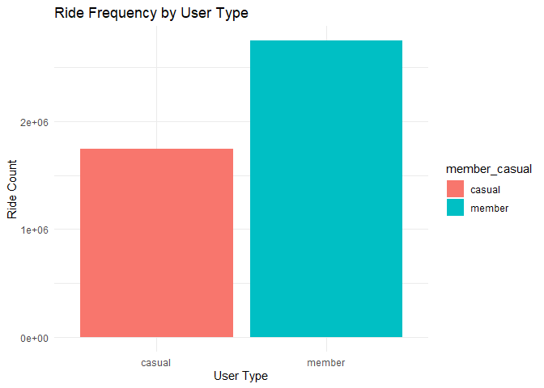

<link rel="stylesheet" href="styles.css">

<!-- HERO SECTION -->

  <h1>Sean — Data Analytics Portfolio</h1>
  
Turning data into actionable insights.   Exploring analytics, visualization, and business intelligence.

---

<!-- FEATURED PROJECTS -->
## 🚴 Featured Projects

### Cyclistic Bike-Share Analysis

A multi-part case study analyzing ride patterns, user types, and business recommendations for Cyclistic.

- [Read Case Study (HTML)](cyclistic_bike_share.html)
- [Case Study v2 (HTML)](cyclistic_bike_share_ver_2.html)
- [Full PDF Report](2023_Bike_Usage_Patterns.pdf)

---

<!-- INTERACTIVE TOOLS -->
## 🛠️ Interactive Tools

- [Task Parser Tool (v1)](parser.html): Extract and format task data from text.
- [Task Parser Tool (v2)](parser_V2.html): Improved parsing and accessibility.
- [Task Parser Tool (v3)](parser_V3.html): Modern UI with dark mode support.

---

## 📚 Resources & Reports

### Business Docs & Reports

- [Album Coffee Shop: Business Plan](Album_Business_Plan_03-13-2025.html)
- [Staffing Analysis (PDF)](Staffing_Analysis.pdf)
- [Duration Analysis (PDF)](NBH_Duration.pdf)
- [Analysis on Tech Givebacks (PDF)](Analysis_on_Giveback.pdf)
- [Cyclistic Case Study from Coursera](Case_Study.pdf)

### Spreadsheets & Data

- [Staffing Analysis Spreadsheet (Excel)](GivebackNotification_VS_Workforce.xlsx)
- [BigQuery Cleaned Cyclistic Table](https://console.cloud.google.com/bigquery?ws=!1m5!1m4!4m3!1sprojectechnhiesean!2sBikeCase!3s2023BikeCaseCleaned_V2)
- [BigQuery 2023 Cyclistic Table](https://console.cloud.google.com/bigquery?ws=!1m5!1m4!4m3!1sprojectechnhiesean!2sBikeCase!3s2023BikeCase)
- [divvy-tripdata](https://divvy-tripdata.s3.amazonaws.com/index.html)
- [divvy-tripdata Data License Agreement](https://divvybikes.com/data-license-agreement)
- [Tableau Dashboard](https://public.tableau.com/views/MinnesotaTrafficVolumeChartsDashboard/Dashboard1?:language=en-US&:sid=&:redirect=auth&:display_count=n&:origin=viz_share_link)

---

<!-- RESUME & CONTACT -->
## 📄 Resume & Contact

**Email:** [technhiesean@gmail.com](mailto:technhiesean@gmail.com)  
**LinkedIn:** [linkedin.com/in/technhiesean](https://www.linkedin.com/in/technhiesean)

**Top Skills:**
- Microsoft Excel
- Google BigQuery
- Tableau

**Education:**
- Coursera: Professional Certificates in Business Intelligence (2023–2024) and Data Analytics (2022–2023)
- AMA University: BS in Information Technology

**Summary:**  
Customer-oriented professional with experience in field operations, technical issue resolution, and data-driven assessments. Seeking a Data Analyst role to drive operational efficiency and business growth.

**Experience Highlights:**
- Rogers Communications (2024–Present): Data analysis, field operations, customer negotiations, project participation.
- Shaw Communications (2019–2023): Field management, technical support, leadership training, escalations.

---

  <em>Site last updated: April 2025</em>

